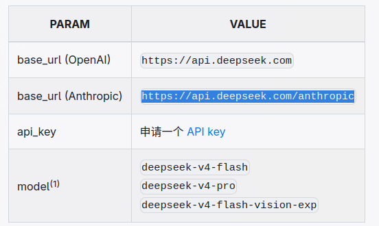

AI 已经完全改变了使用电脑的方式，这一部分会介绍 AI 辅助使用桌面版 Linux 的一些简单例子，介绍一些常见 Harness 程序。

## 什么是 AI Harness

Harness，字面意思是套在马身上让马干活的东西，AI Harness 可以简单理解为以 LLM 为“大脑”，配备一系列工具，让其能够自主完成各式各样任务的程序，

## opencode

解释再多不如亲自上手试试。opencode 是一个开源的 AI Coding Agent（AI 编程智能体）软件，提供了免费的模型，开箱即用。

打开终端，安装方法如下：

- Linux Mint

    可以使用官方脚本。

    ```
    curl -fsSL https://opencode.ai/install | bash
    ```

- CachyOS / Arch Linux

    Arch 系可以直接从包管理器安装。

    ```
    sudo pacman -S opencode
    ```
    >Arch 系也可以试试从 AUR 安装 [Miyu](https://ithub.global.ssl.fastly.net/SHORiN-KiWATA/Miyu)，这是我自己的项目。

启动只需运行 `opencode` 命令即可。

### 配置网络搜索

可以去获取几个网络搜索 API，例如 [Tavily](https://www.tavily.com/)、[Firecrawl](https://www.firecrawl.dev/)、[AnySearch](https://www.anysearch.com/home)。然后把 API 交给 AI，让它自己写一个网络搜索工具，免费额度一般就够日常使用了。

## 使用场景

想象一下，你在终端敲下一段命令，某种程度上就相当于你在跟终端对话，只不过说的是“终端语言”，而不是自然语言。理解了这一本质，也就明白了 AI 为什么会改变使用电脑，尤其是使用 Linux 系统的方式。Linux 通常不依赖 GUI，可以通过 CLI（命令行）完成大多数事情。通过自然语言跟 AI 对话，AI 会运行合适的命令去执行我们交给它的任务，这就让一个完全不懂 CLI 的人也能拥有使用 CLI 的能力，而 CLI 的强大和便利，无需多言。

以下是一些简单的使用场景示例：

- 软件管理

    软件的安装、卸载、更新、查询都是非常常用的操作。假设我现在想要安装 `firefox` 浏览器，而我完全不知道安装软件的命令，没关系，我可以直接跟 AI 说：“安装 firefox”，然后 AI 就会运行合适的命令帮我装上 `firefox`，其他诸如卸载、更新之类的操作也是同理。

- 软件推荐

    假设我想要一个音乐播放器，而我不知道安装什么好。直接跟 AI 说：“有推荐的音乐播放器吗”，AI 就会给出答案。如果配有网络搜索的工具，甚至能够省去自己二次确认的功夫。

- 软件配置

    配置软件是一个比较复杂的部分，但是现在我们可以把软件的配置文档直接发给 AI，然后跟 AI 提自己的需求：“这是 Kitty 的官方文档，参考文档，帮我美化一下。”

    假设我想要运行 Windows 程序，但是我不知道该怎么做，我可以说：“我要怎么在 Linux 上运行 Windows 程序？帮我配置一下。”

- 查询信息

    假设我想要知道一款游戏能不能在 Linux 上玩，除了自己去浏览器搜索，还可以让 AI 查询：“Linux能玩异环吗？”

    如果我想要知道一款软件包的信息，我也不需要手动去查：“帮我查一下 firefox 的新版本更新了什么。”

- 杀死卡死的进程

    日用系统时难免会有程序卡死，甚至用强制关闭都关不了，但现在我们可以说：“我的xxx软件窗口卡死了，关不掉，帮我处理一下。”

- 查询资源占用

    当电脑出现卡顿，我们通常想要打开任务管理器看看是什么东西在吃资源，但现在我们可以说：“我电脑有点卡，帮我排查一下是什么原因。”

- 硬盘清理

    硬盘空间快满了，我们通常会打开一个`磁盘使用情况分析工具`去查找硬盘被谁吃了，但是现在我们可以说：“我的硬盘空间快满了，看看有什么能够清理的。”

- 获取资源

    在网上找资源要跟广告和虚假内容斗智斗勇，让人头疼，但是我现在我们可以说：“帮我从网上下载xxxxx电影”，“帮我从网上下载xxxx游戏”。文档、代码、数据之类的内容自然也可以，~~甚至可以找涩图和小电影~~。

- 视频和图片编辑

    众所周知，很多视频、图片编辑软件本质是`ffmpeg`套壳，现在我们可以通过自然语言直接让 AI 用命令行进行多媒体编辑。
    
    这在日常生活中非常实用，我想大家肯定都遇到过上传图片超出了网站对图片的大小限制的情况，这时候就可以说：“帮我把这个这个图片压缩到 1MB 以内”；压缩视频自然也可以：“帮我把这个视频的大小压缩到 10MB 以内。”

    甚至可以将图片变成透明背景：“帮我把这张图改成透明背景。”

    如果想要从录制视频中裁剪出一段，也不需要开启繁重的 GUI 软件：“帮我剪出这个视频的 1 分 32 秒到 2 分 40 秒的内容。”

    还可以转码，例如：“帮我把这个图片转成 PNG 格式”，“帮我用 H264 编码这个视频。”

    甚至可以加效果：“帮我在这个视频的开头和末尾加上淡入淡出效果。”

- 操作文件

    接入终端的 AI 可以通过命令操作系统的文件，例如：“找出我电脑上所有的xxxx软件的配置文件，在xxxx行的下面添加xxxxx内容。” 

- 异常诊断

    日用系统可能会出现软件打不开、输入法无法使用、渲染错误、“睡死”之类的疑难杂症，对于一个没有计算机知识的人来说，想解决这些问题需要花不少时间去学习，但是现在我们可以直接让 AI 去排查：“我的xxxx软件无法使用输入法，帮我检查一下。”

这些都是很简单，但是很实用的场景，能切实地提升日用 Linux 的体验，所以我认为 AI 助手是如今日用 Linux 系统的必装软件之一。而且你可以设想一下通过 AI 做到自动化，将我们原本需要手动进行的复杂任务编写成流程文档，然后让 AI 依照文档进行操作，这将大幅提高工作效率。不过，这就是另外的话题了，感兴趣的可以自己研究一下。

## 哪里有便宜好用的 AI

这部分简单说一下我知道的，可以用于 Agent 的免费 API 或者免费账号额度，以及性价比高的订阅套餐。

- [OpencodeZen](https://opencode.ai/zen)

    去注册一个opencode的账号，获取到 OpencodeZen 的 APi Key，填入 Opencode 中就可以使用 OpencodeZen 里的免费模型。

- Codex / Antigravity / Cursor 

    Codex 是 OpenAI 的，Antigravity 是谷歌的，Cursor 是马斯克的，这三个 Harness 注册并登录后都能获得一些免费额度，几个号换着用的话还是挺多的。

- [日日新](https://www.sensenova.cn/token-plan)

    日日新目前可以免费使用。

## 拓展：在任意软件调用 AI 

可以简单了解一下调用 AI 的方式。

### 通过 API 调用

以 Deepseek 为例，阅读他们的[官方接口文档](https://api-docs.deepseek.com/zh-cn/)



可以在表格中找到这三样东西：`base_url`决定了请求谁，`api_key`是密钥，`model`决定了使用什么模型。有了这三样东西就可以在任意地方调用 AI 了。

### 通过订阅调用

以 OpenAI 举例，只要你注册了他们的账号，就可以登录 `codex` 这个 OpenAI 自家的软件，并获得一定的使用额度。

这个额度不能通过 API 调用，也没有`api_key`，只能在 `codex` 里用，但是通过`codex`提供的命令行，我们就能把 `codex` 当作软件的后端，做到在任意软件里使用订阅额度。